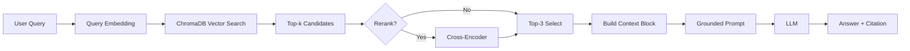

# Architecture — RAG Pipeline (Day 08 Lab)

> Template: Điền vào các mục này khi hoàn thành từng sprint.
> Deliverable của Documentation Owner.

## 1. Tổng quan kiến trúc

```
[Raw Docs]
    ↓
[index.py: Preprocess → Chunk → Embed → Store]
    ↓
[ChromaDB Vector Store]
    ↓
[rag_answer.py: Query → Retrieve → Rerank → Generate]
    ↓
[Grounded Answer + Citation]
```

**Mô tả ngắn gọn:**
Hệ thống này là một trợ lý RAG nội bộ dùng để trả lời câu hỏi cho CS + IT Helpdesk dựa trên các tài liệu chính sách/SLA/SOP/FAQ. Pipeline được thiết kế để (1) retrieve đúng đoạn có bằng chứng, (2) tạo câu trả lời grounded có citation, và (3) abstain khi tài liệu không có thông tin để tránh hallucination.

---

## 2. Indexing Pipeline (Sprint 1)

### Tài liệu được index
| File | Nguồn | Department | Số chunk |
|------|-------|-----------|---------|
| `policy_refund_v4.txt` | policy/refund-v4.pdf | CS | 6 |
| `sla_p1_2026.txt` | support/sla-p1-2026.pdf | IT | 5 |
| `access_control_sop.txt` | it/access-control-sop.md | IT Security | 7 |
| `it_helpdesk_faq.txt` | support/helpdesk-faq.md | IT | 6 |
| `hr_leave_policy.txt` | hr/leave-policy-2026.pdf | HR | 5 |

### Quyết định chunking
| Tham số | Giá trị | Lý do |
|---------|---------|-------|
| Chunk size | 400 tokens (ước lượng = ký tự/4) | Cân bằng giữa “đủ ngữ cảnh” và “không quá dài” để LLM trích xuất đúng ý; giảm mất chi tiết ở các câu cần nhiều mốc số liệu. |
| Overlap | 80 tokens | Giữ ngữ cảnh liền mạch giữa 2 chunk, tránh mất ý khi điều khoản nằm ở ranh giới chunk. |
| Chunking strategy | Heading-based trước, sau đó paragraph-based packing | `index.py` tách theo heading dạng `=== ... ===` để giữ cấu trúc tài liệu; nếu section dài thì ghép theo paragraph đến khi đủ size, thêm overlap bằng 1 câu cuối (fallback: ~30% cuối). |
| Metadata fields | `source`, `section`, `department`, `effective_date`, `access` | Phục vụ filter, freshness/versioning, debug và citation. |

### Embedding model
- **Model (default)**: OpenAI `text-embedding-3-small` (qua `OPENAI_EMBEDDING_MODEL`)
- **Fallback local (nếu cấu hình)**: SentenceTransformers `paraphrase-multilingual-MiniLM-L12-v2` (qua `LOCAL_EMBEDDING_MODEL`)
- **Provider order**: `EMBEDDING_PROVIDER` (mặc định: `openai,local`)
- **Vector store**: ChromaDB (PersistentClient), collection `rag_lab`, lưu tại `chroma_db/`
- **Similarity metric**: Cosine (`metadata={"hnsw:space": "cosine"}`)

---

## 3. Retrieval Pipeline (Sprint 2 + 3)

### Baseline (Sprint 2)
| Tham số | Giá trị |
|---------|---------|
| Strategy | Dense (embedding similarity qua ChromaDB) |
| Top-k search | 10 |
| Top-k select | 3 |
| Rerank | Không |

### Variant (Sprint 3)
| Tham số | Giá trị | Thay đổi so với baseline |
|---------|---------|------------------------|
| Strategy | Hybrid (Dense + Sparse BM25) + RRF | Đổi từ dense → hybrid để giữ cả semantic match và keyword/alias match |
| Top-k search | 20 | Tăng search rộng để tạo pool candidates đủ tốt cho rerank |
| Top-k select | 3 | Giữ nguyên (top-3 để prompt gọn và ổn định) |
| Rerank | Cross-encoder `cross-encoder/ms-marco-MiniLM-L-6-v2` | Bật `use_rerank=True` để ưu tiên chunk “thực sự trả lời câu hỏi” |
| Query transform | Không bật trong pipeline (hàm `transform_query()` hiện là placeholder) | Chưa áp dụng trong `rag_answer()` |

**Chi tiết hybrid (trong `rag_answer.py`):**
- Sparse retrieval dùng BM25 (`rank_bm25`) với tokenizer đơn giản Việt/Anh.
- Kết hợp dense + sparse bằng Reciprocal Rank Fusion (RRF):
  - `dense_weight = 0.75`, `sparse_weight = 0.25`, `rrf_k = 60`.

**Lý do chọn variant này:**
Nhóm chọn hybrid + rerank vì corpus gồm cả câu tự nhiên (policy) lẫn nhiều keyword/tên riêng (SLA P1, mã lỗi, thuật ngữ quy trình). Hybrid giúp tăng khả năng “không bỏ sót” khi query có exact term/alias, còn rerank giúp giảm noise và ưu tiên các chunk đủ ý để cải thiện completeness ở các câu cần nhiều chi tiết.

---

## 4. Generation (Sprint 2)

### Grounded Prompt Template
```
Answer only from the retrieved context below.
If the context is insufficient, say you do not know.
Cite the source field when possible.
Keep your answer short, clear, and factual.

Question: {query}

Context:
[1] {source} | {section} | score={score}
{chunk_text}

[2] ...

Answer:
```

### LLM Configuration
| Tham số | Giá trị |
|---------|---------|
| Model | OpenAI Chat Completions: `gpt-4o` |
| Temperature | 0 (để output ổn định cho eval) |
| Max tokens | 512 |

---

## 5. Failure Mode Checklist

> Dùng khi debug — kiểm tra lần lượt: index → retrieval → generation

| Failure Mode | Triệu chứng | Cách kiểm tra |
|-------------|-------------|---------------|
| Index lỗi | Retrieve về sai tài liệu / metadata sai | Chạy `index.py` để xem metadata parse; dùng `inspect_metadata_coverage()` để kiểm tra thiếu `source/effective_date`. |
| Chunking tệ | Chunk cắt giữa điều khoản → answer thiếu ý | Chạy `index.py` (test preprocess+chunking) và đọc preview; kiểm tra section split theo `=== ... ===`. |
| Retrieval lỗi | Không tìm thấy expected source / retrieve sai category | Chạy `rag_answer(..., verbose=True)` để xem top candidates và `sources`; dùng `score_context_recall()` trong `eval.py`. |
| Rerank gây tụt chất lượng | Có evidence nhưng bị chọn nhầm chunk | So sánh trước/sau rerank bằng cách bật/tắt `use_rerank`; tăng/giảm `top_k_search`. |
| Generation lỗi | Answer không grounded / bịa | Kiểm tra `build_grounded_prompt()` và output; dùng điểm Faithfulness trong scorecard. |
| Token overload | Context dài → lost in the middle | Giữ `top_k_select=3`, cắt ngắn chunk hoặc giảm chunk_size nếu cần. |

---

## 6. Diagram (tùy chọn)


